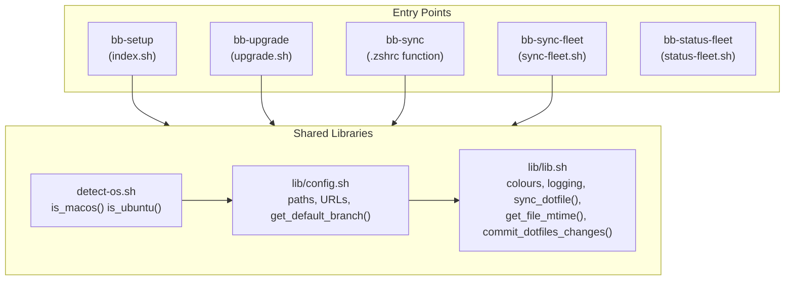
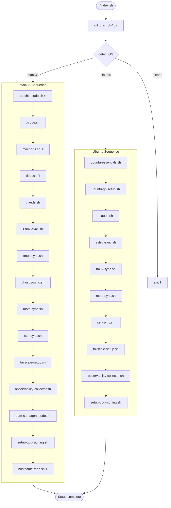
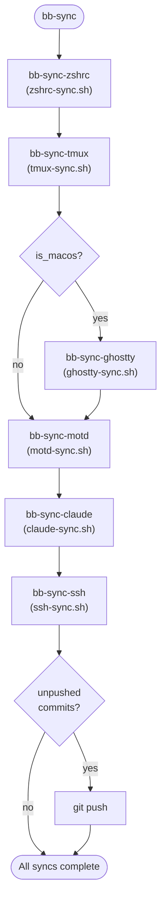
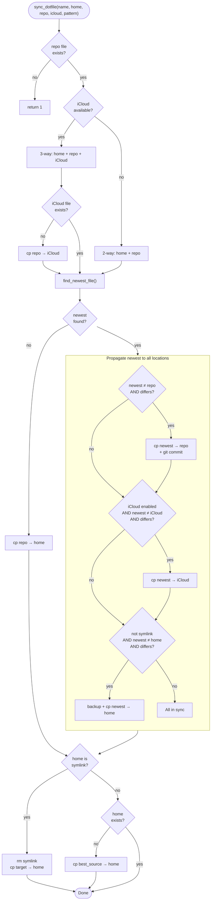
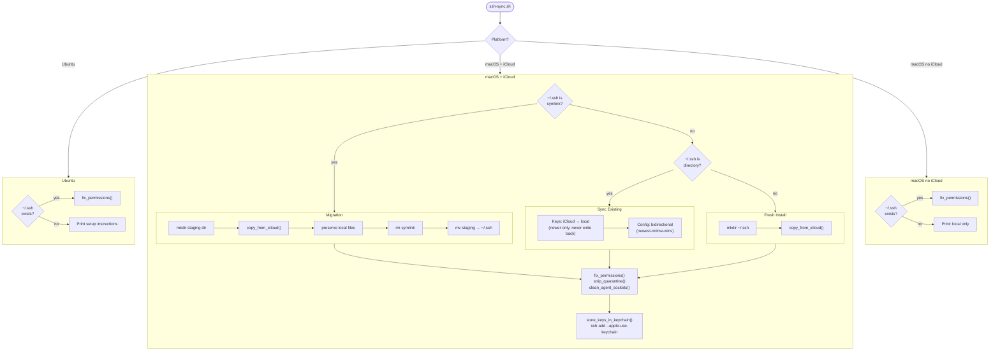
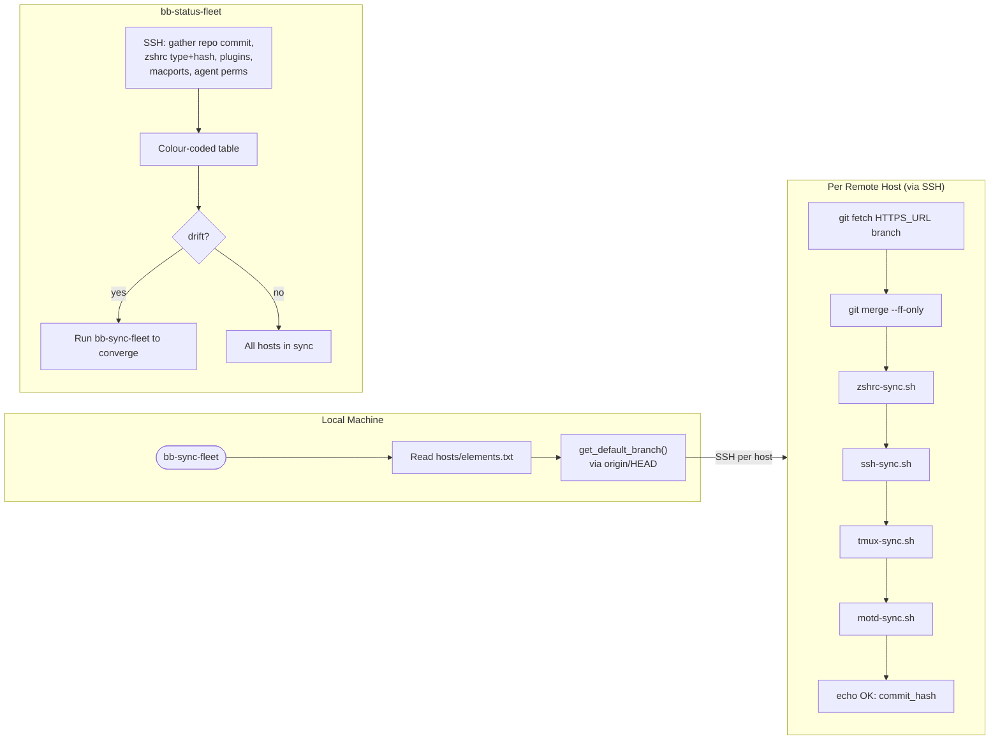
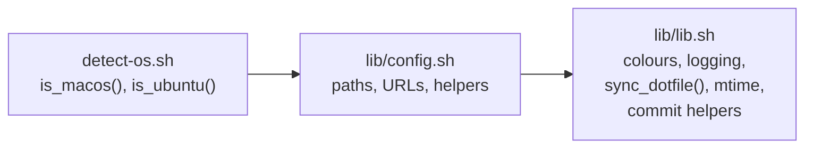
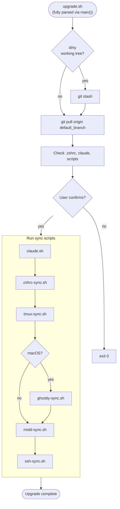

# Boblbee Architecture

## System Overview



## Fresh Install: `index.sh`



_⚡ = requires sudo, 🐚 = runs under zsh shebang, all others run under bash_

## `bb-sync` Flow



## `sync_dotfile()` — Core Sync Logic

Used by `zshrc-sync.sh` and `motd-sync.sh`.



## SSH Sync Flow



## Fleet Management



## Source Chain Convention

Every script follows this source order:



## Upgrade Flow



## File Locations

```
~/                                    ~/.config/
├── .zshrc         (local copy)       └── claude/memory/
├── .motd          (local copy)           └── user.md    (local copy)
├── .tmux.conf     (local copy)       ~/.config/tmux/
├── .ssh/          (local directory)      ├── tmux-base.conf
│   ├── config  ←→ iCloud (bidir)        ├── tmux-theme-dark.conf
│   ├── auth_keys ←→ iCloud (bidir)      └── tmux-theme-light.conf
│   └── id_*     ← iCloud (read-only)
│
│  ~/Developer/workspace/matdotcx/boblbee/   (canonical repo path)
│  ├── assets/.zshrc            ←→ home + iCloud (3-way, newest wins)
│  ├── assets/.motd             ←→ home + iCloud (3-way, newest wins)
│  ├── assets/tmux*.conf        ←→ home (2-way, newest wins)
│  ├── assets/ghostty-config    ←→ ~/Library/.../ghostty (2-way)
│  ├── assets/ghostty-themes/   ←→ ~/.config/ghostty/themes (2-way)
│  ├── claude/memory/user.md    ←→ ~/.config/claude/memory (2-way)
│  └── scripts/lib/{config,lib}.sh
│
│  ~/Library/Mobile Documents/.../Ark/Sync/System/   (iCloud, macOS only)
│  ├── .zshrc       ←→ repo + home (3-way participant)
│  ├── .motd        ←→ repo + home (3-way participant)
│  └── .ssh/
│      ├── config        ←→ local (bidirectional)
│      ├── authorized_keys ←→ local (bidirectional)
│      └── id_*          → local (read-only seed)
```
