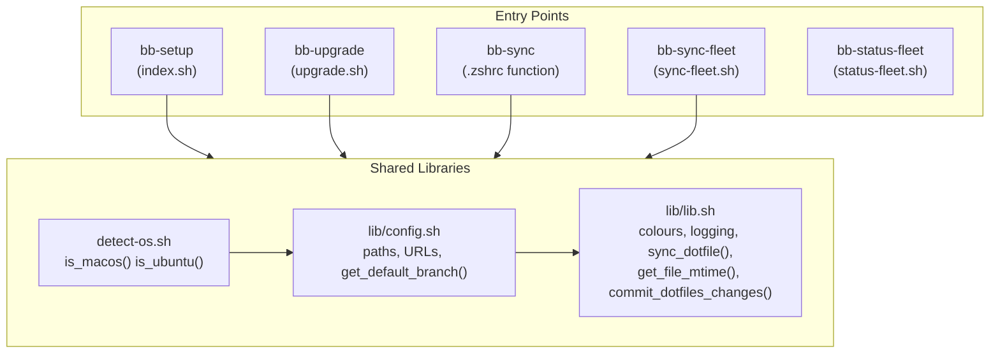
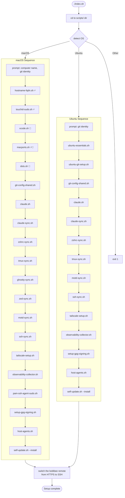
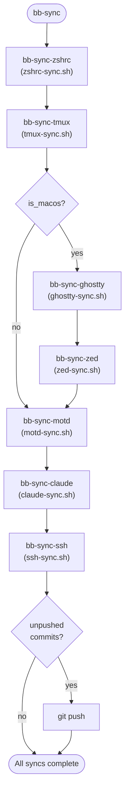
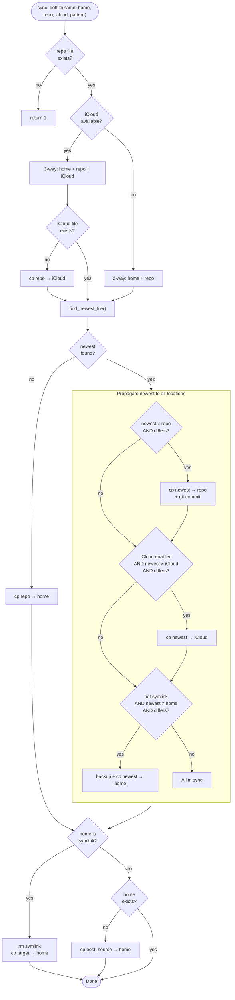
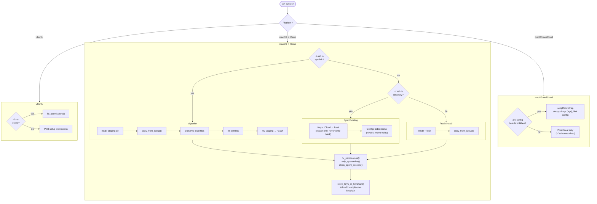
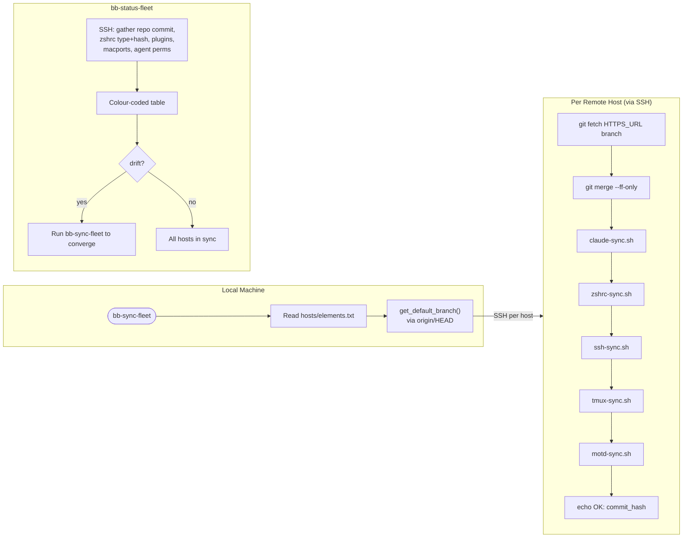
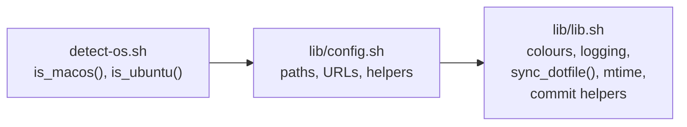
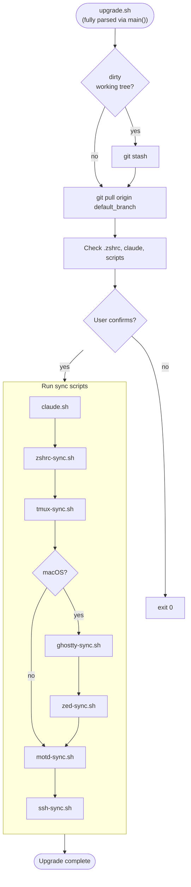
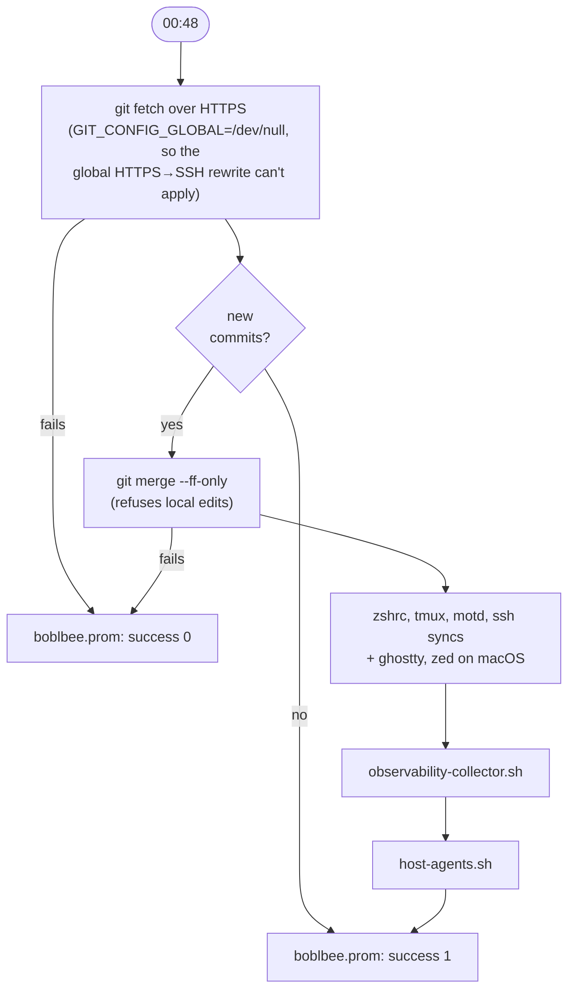

# Boblbee Architecture

## System Overview


```mermaid
flowchart TB
    subgraph entrypoints["Entry Points"]
        setup["bb-setup<br/>(index.sh)"]
        upgrade["bb-upgrade<br/>(upgrade.sh)"]
        sync["bb-sync<br/>(.zshrc function)"]
        fleet_sync["bb-sync-fleet<br/>(sync-fleet.sh)"]
        fleet_status["bb-status-fleet<br/>(status-fleet.sh)"]
    end

    subgraph libs["Shared Libraries"]
        detect["detect-os.sh<br/>is_macos() is_ubuntu()"]
        config["lib/config.sh<br/>paths, URLs, get_default_branch()"]
        lib["lib/lib.sh<br/>colours, logging, sync_dotfile(),<br/>get_file_mtime(), commit_dotfiles_changes()"]
        detect --> config --> lib
    end

    setup --> libs
    upgrade --> libs
    sync --> libs
    fleet_sync --> libs
```

## Fresh Install: `index.sh`


```mermaid
flowchart TD
    start(["./index.sh"]) --> cd_scripts["cd to scripts/ dir"]
    cd_scripts --> detect{"detect OS"}

    detect -->|macOS| mac_seq
    detect -->|Ubuntu| ubuntu_seq
    detect -->|Other| fail["exit 1"]

    subgraph mac_seq["macOS Sequence"]
        direction TB
        m0["prompt: computer name, git identity"] --> m1["hostname-fqdn.sh ⚡"]
        m1 --> m2["touchid-sudo.sh ⚡"]
        m2 --> m3["xcode.sh 🐚"]
        m3 --> m4["macports.sh ⚡🐚"]
        m4 --> m5["dots.sh 🐚"]
        m5 --> m6["git-config-shared.sh"]
        m6 --> m7["claude.sh"]
        m7 --> m8["claude-sync.sh"]
        m8 --> m9["zshrc-sync.sh"]
        m9 --> m10["tmux-sync.sh"]
        m10 --> m11["ghostty-sync.sh"]
        m11 --> m12["zed-sync.sh"]
        m12 --> m13["motd-sync.sh"]
        m13 --> m14["ssh-sync.sh"]
        m14 --> m15["tailscale-setup.sh"]
        m15 --> m16["observability-collector.sh"]
        m16 --> m17["pam-ssh-agent-sudo.sh"]
        m17 --> m18["setup-gpg-signing.sh"]
        m18 --> m19["host-agents.sh"]
        m19 --> m20["self-update.sh --install"]
    end

    subgraph ubuntu_seq["Ubuntu Sequence"]
        direction TB
        u0["prompt: git identity"] --> u1["ubuntu-essentials.sh"]
        u1 --> u2["ubuntu-git-setup.sh"]
        u2 --> u3["git-config-shared.sh"]
        u3 --> u4["claude.sh"]
        u4 --> u5["claude-sync.sh"]
        u5 --> u6["zshrc-sync.sh"]
        u6 --> u7["tmux-sync.sh"]
        u7 --> u8["motd-sync.sh"]
        u8 --> u9["ssh-sync.sh"]
        u9 --> u10["tailscale-setup.sh"]
        u10 --> u11["observability-collector.sh"]
        u11 --> u12["setup-gpg-signing.sh"]
        u12 --> u13["host-agents.sh"]
        u13 --> u14["self-update.sh --install"]
    end

    mac_seq --> remote["switch the boblbee remote<br/>from HTTPS to SSH"]
    ubuntu_seq --> remote
    remote --> done(["Setup complete"])
```

_⚡ = requires sudo, 🐚 = runs under zsh shebang, all others run under bash_

## `bb-sync` Flow


```mermaid
flowchart TD
    bb_sync(["bb-sync"]) --> zshrc["bb-sync-zshrc<br/>(zshrc-sync.sh)"]
    zshrc --> tmux["bb-sync-tmux<br/>(tmux-sync.sh)"]
    tmux --> ghostty_check{"is_macos?"}
    ghostty_check -->|yes| ghostty["bb-sync-ghostty<br/>(ghostty-sync.sh)"]
    ghostty_check -->|no| motd
    ghostty --> zed["bb-sync-zed<br/>(zed-sync.sh)"]
    zed --> motd["bb-sync-motd<br/>(motd-sync.sh)"]
    motd --> claude["bb-sync-claude<br/>(claude-sync.sh)"]
    claude --> ssh["bb-sync-ssh<br/>(ssh-sync.sh)"]
    ssh --> push_check{"unpushed<br/>commits?"}
    push_check -->|yes| push["git push"]
    push_check -->|no| done(["All syncs complete"])
    push --> done
```

## `sync_dotfile()` — Core Sync Logic

Used by `zshrc-sync.sh` and `motd-sync.sh`.


```mermaid
flowchart TD
    start(["sync_dotfile(name, home, repo, icloud, pattern)"]) --> check_repo{"repo file<br/>exists?"}
    check_repo -->|no| err["return 1"]
    check_repo -->|yes| check_icloud{"iCloud<br/>available?"}

    check_icloud -->|yes| three["3-way: home + repo + iCloud"]
    check_icloud -->|no| two["2-way: home + repo"]

    three --> seed{"iCloud file<br/>exists?"}
    seed -->|no| seed_cp["cp repo → iCloud"]
    seed -->|yes| find_newest
    seed_cp --> find_newest

    two --> find_newest["find_newest_file()"]

    find_newest --> newest_exists{"newest<br/>found?"}
    newest_exists -->|no| install["cp repo → home"]
    newest_exists -->|yes| propagate

    subgraph propagate["Propagate newest to all locations"]
        direction TB
        p1{"newest ≠ repo<br/>AND differs?"} -->|yes| cp_repo["cp newest → repo<br/>+ git commit"]
        p1 -->|no| p2
        cp_repo --> p2{"iCloud enabled<br/>AND newest ≠ iCloud<br/>AND differs?"}
        p2 -->|yes| cp_icloud["cp newest → iCloud"]
        p2 -->|no| p3
        cp_icloud --> p3{"not symlink<br/>AND newest ≠ home<br/>AND differs?"}
        p3 -->|yes| cp_home["backup + cp newest → home"]
        p3 -->|no| synced["All in sync"]
    end

    propagate --> migrate{"home is<br/>symlink?"}
    migrate -->|yes| do_migrate["rm symlink<br/>cp target → home"]
    migrate -->|no| home_check{"home<br/>exists?"}
    home_check -->|no| final_install["cp best_source → home"]
    home_check -->|yes| done(["Done"])
    do_migrate --> done
    final_install --> done
    install --> migrate
```

## SSH Sync Flow


```mermaid
flowchart TD
    start(["ssh-sync.sh"]) --> platform{"Platform?"}

    platform -->|Ubuntu| ubuntu_ssh
    platform -->|macOS + iCloud| mac_icloud
    platform -->|macOS no iCloud| mac_local

    subgraph ubuntu_ssh["Ubuntu"]
        u1{"~/.ssh<br/>exists?"} -->|yes| u2["fix_permissions()"]
        u1 -->|no| u3["Print setup instructions"]
    end

    subgraph mac_icloud["macOS + iCloud"]
        direction TB
        m1{"~/.ssh is<br/>symlink?"} -->|yes| migrate
        m1 -->|no| m2{"~/.ssh is<br/>directory?"}
        m2 -->|yes| sync_existing
        m2 -->|no| fresh

        subgraph migrate["Migration"]
            mig1["mkdir staging dir"] --> mig2["copy_from_icloud()"]
            mig2 --> mig3["preserve local files"]
            mig3 --> mig4["rm symlink"]
            mig4 --> mig5["mv staging → ~/.ssh"]
        end

        subgraph sync_existing["Sync Existing"]
            se1["Keys: iCloud → local<br/>(newer only, never write back)"]
            se1 --> se2["Config: bidirectional<br/>(newest-mtime-wins)"]
        end

        subgraph fresh["Fresh Install"]
            f1["mkdir ~/.ssh"] --> f2["copy_from_icloud()"]
        end

        migrate --> perms["fix_permissions()<br/>strip_quarantine()<br/>clean_agent_sockets()"]
        sync_existing --> perms
        fresh --> perms
        perms --> keychain["store_keys_in_keychain()<br/>ssh-add --apple-use-keychain"]
    end

    subgraph mac_local["macOS no iCloud"]
        ark{"ark-config<br/>beside boblbee?"} -->|yes| boot["script/bootstrap<br/>decrypt keys (age), link config"]
        ark -->|no| ml3["Print: local only<br/>(~/.ssh untouched)"]
    end
```

On Ubuntu, `ssh-sync.sh` only checks permissions; run `script/bootstrap` directly to wire
keys and config from ark-config.

## Fleet Management


```mermaid
flowchart LR
    subgraph local["Local Machine"]
        sync_fleet(["bb-sync-fleet"]) --> get_hosts["Read hosts/elements.txt"]
        get_hosts --> get_branch["get_default_branch()<br/>via origin/HEAD"]
    end

    subgraph per_host["Per Remote Host (via SSH)"]
        direction TB
        fetch["git fetch HTTPS_URL branch"] --> merge["git merge --ff-only"]
        merge --> run_claude["claude-sync.sh"]
        run_claude --> run_zshrc["zshrc-sync.sh"]
        run_zshrc --> run_ssh["ssh-sync.sh"]
        run_ssh --> run_tmux["tmux-sync.sh"]
        run_tmux --> run_motd["motd-sync.sh"]
        run_motd --> report["echo OK: commit_hash"]
    end

    get_branch -->|"SSH per host"| per_host

    subgraph status["bb-status-fleet"]
        direction TB
        s1["SSH: gather repo commit,<br/>zshrc type+hash, plugins,<br/>macports, agent perms"] --> s2["Colour-coded table"]
        s2 --> s3{"drift?"}
        s3 -->|yes| s4["Run bb-sync-fleet to converge"]
        s3 -->|no| s5["All hosts in sync"]
    end
```

## Source Chain Convention

Every script follows this source order:


```mermaid
flowchart LR
    A["detect-os.sh<br/>is_macos(), is_ubuntu()"] --> B["lib/config.sh<br/>paths, URLs, helpers"]
    B --> C["lib/lib.sh<br/>colours, logging,<br/>sync_dotfile(), mtime,<br/>commit helpers"]
```

## Upgrade Flow


```mermaid
flowchart TD
    start(["upgrade.sh<br/>(fully parsed via main())"]) --> stash{"dirty<br/>working tree?"}
    stash -->|yes| do_stash["git stash"]
    stash -->|no| pull
    do_stash --> pull["git pull origin default_branch"]
    pull --> check["Check .zshrc, claude, scripts"]
    check --> confirm{"User confirms?"}
    confirm -->|no| cancel["exit 0"]
    confirm -->|yes| run_scripts

    subgraph run_scripts["Run sync scripts"]
        direction TB
        r1["claude.sh"] --> r2["zshrc-sync.sh"]
        r2 --> r3["tmux-sync.sh"]
        r3 --> r4{"macOS?"}
        r4 -->|yes| r5["ghostty-sync.sh"]
        r4 -->|no| r6
        r5 --> r5b["zed-sync.sh"]
        r5b --> r6["motd-sync.sh"]
        r6 --> r7["ssh-sync.sh"]
    end

    run_scripts --> done(["Upgrade complete"])
```

## Nightly Self-Update: `self-update.sh`

Installed by `index.sh` (`--install`): the LaunchAgent `org.iaconelli.boblbee-self-update` on
macOS, a crontab line on Linux, both at 00:48.


```mermaid
flowchart TD
    start(["00:48"]) --> fetch["git fetch over HTTPS<br/>(GIT_CONFIG_GLOBAL=/dev/null, so the<br/>global HTTPS→SSH rewrite can't apply)"]
    fetch -->|fails| fail["boblbee.prom: success 0"]
    fetch --> same{"new<br/>commits?"}
    same -->|no| ok["boblbee.prom: success 1"]
    same -->|yes| merge["git merge --ff-only<br/>(refuses local edits)"]
    merge -->|fails| fail
    merge --> syncs["zshrc, tmux, motd, ssh syncs<br/>+ ghostty, zed on macOS"]
    syncs --> collector["observability-collector.sh"]
    collector --> agents["host-agents.sh"]
    agents --> ok
```

`boblbee.prom` lands in node_exporter's textfile directory (`~/.local/share/prometheus/textfile`),
so the last run's time, result and commit are scraped with the host's metrics. The syncs and
`host-agents.sh` only run on nights that bring new commits.

## File Locations

```
~/                                    ~/.config/
├── .zshrc         (local copy)       └── claude/memory/
├── .motd          (local copy)           └── user.md    (local copy)
├── .claude/settings.json (local copy) ~/.local/share/prometheus/textfile/
├── .claude/hooks/ (← assets/claude-hooks)  └── boblbee.prom, <profile>.prom
├── .tmux.conf     (local copy)       ~/.config/tmux/
├── .ssh/          (local directory)      ├── tmux-base.conf
│   ├── config  ←→ iCloud (bidir)        ├── tmux-theme-dark.conf
│   ├── auth_keys ←→ iCloud (bidir)      └── tmux-theme-light.conf
│   └── id_*     ← iCloud (read-only)
│
│  ~/Developer/workspace/matdotcx/boblbee/   (canonical repo path)
│  ├── assets/.zshrc            ←→ home + iCloud (3-way, newest wins)
│  ├── assets/.motd             ←→ home + iCloud (3-way, newest wins)
│  ├── assets/tmux*.conf        ←→ home (2-way, newest wins)
│  ├── assets/ghostty-config    ←→ ~/Library/.../ghostty (2-way)
│  ├── assets/ghostty-themes/   ←→ ~/.config/ghostty/themes (2-way)
│  ├── assets/zed/settings.json ←→ ~/.config/zed/ (2-way)
│  ├── assets/zed/keymap.json   ←→ ~/.config/zed/ (2-way)
│  ├── assets/zed/themes/       ←→ ~/.config/zed/themes/ (2-way)
│  ├── claude/memory/user.md    ←→ ~/.config/claude/memory (2-way)
│  ├── assets/claude-settings.json ←→ ~/.claude/settings.json (2-way)
│  └── scripts/lib/{config,lib}.sh
│
│  ~/Library/Mobile Documents/.../Ark/Sync/System/   (iCloud, macOS only)
│  ├── .zshrc       ←→ repo + home (3-way participant)
│  ├── .motd        ←→ repo + home (3-way participant)
│  └── .ssh/
│      ├── config        ←→ local (bidirectional)
│      ├── authorized_keys ←→ local (bidirectional)
│      └── id_*          → local (read-only seed)
```
